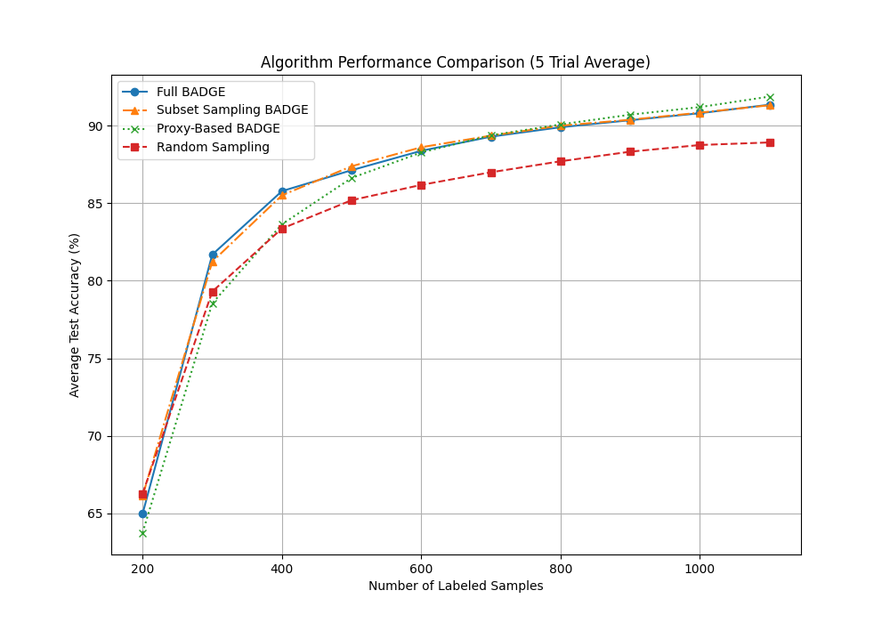
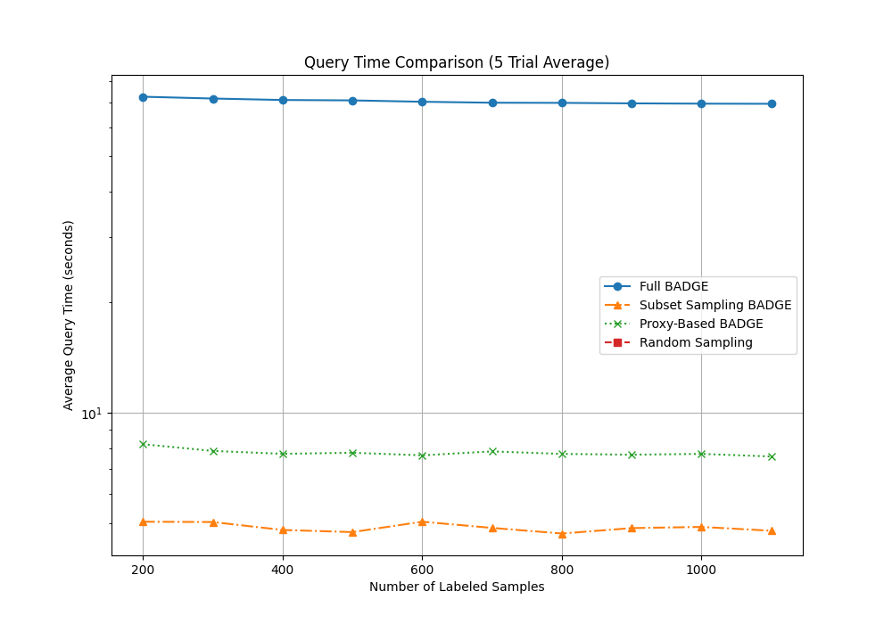

# An Implementation and Acceleration of the BADGE Active Learning Algorithm

[cite_start]This project is a PyTorch implementation of the paper "[Deep Batch Active Learning by Diverse, Uncertain Gradient Lower Bounds](https://arxiv.org/pdf/1906.0371.pdf)" [cite: 1-12]. The primary goal was to first replicate the paper's findings by comparing the BADGE algorithm against a random sampling baseline on the MNIST dataset. Subsequently, this work investigates, implements, and analyzes two novel optimization strategies—Subset Sampling and Proxy-Based Selection—to accelerate the algorithm's primary performance bottleneck.

## Key Files
* `train.py`: Runs the full BADGE active learning experiment.
* `train_random.py`: Runs the random sampling baseline experiment.
* `train_subset_sampling.py`: Runs the BADGE algorithm with the Subset Sampling optimization.
* `train_proxy.py`: Runs the BADGE algorithm with the Proxy-Based Selection optimization.
* `plot_results.py`: Parses the `.txt` output files from all experiments and generates final comparison plots for accuracy and query time.
* `model.py`: Defines the simple Multilayer Perceptron (MLP) architecture used for the experiments.
* `utils.py`: Contains helper functions, including the logic for the BADGE selection strategy.

## Setup Instructions

To run this project, you'll need to set up a Python virtual environment and install the required dependencies.

1.  **Clone the repository:**
    ```bash
    git clone [https://github.com/Sangha0822/Deep-Batch-Active-Learning.git](https://github.com/Sangha0822/Deep-Batch-Active-Learning.git)
    cd Deep-Batch-Active-Learning
    ```

2.  **Create and activate a virtual environment:**
    ```bash
    python -m venv env
    source env/bin/activate
    ```

3.  **Install dependencies:**
    ```bash
    pip install -r requirements.txt
    ```

## How to Run the Experiments

Each experiment should be run for 5 trials to get a reliable average performance. The results will be appended to their respective `.txt` files.

1.  **Run the Full BADGE Algorithm:**
    ```bash
    python train.py
    ```
    *(Results are saved to `results_badge.txt`)*

2.  **Run the Random Sampling Baseline:**
    ```bash
    python train_random.py
    ```
    *(Results are saved to `results_random.txt`)*

3.  **Run the Subset Sampling Optimization:**
    ```bash
    python train_subset_sampling.py
    ```
    *(Results are saved to `results_subset_badge.txt`)*

4.  **Run the Proxy-Based Optimization:**
    ```bash
    python train_proxy.py
    ```
    *(Results are saved to `results_proxy.txt`)*

5.  **Generate the Comparison Plots:**
    Once all data has been collected, run the plotting script:
    ```bash
    python plot_results.py
    ```
    *(This will display two plots and save them as `accuracy_comparison.png` and `query_time_comparison.png`)*

## Results

The experiments successfully validated the BADGE algorithm and demonstrated the effectiveness of our proposed optimizations. The BADGE-based methods consistently outperformed the random sampling baseline in label efficiency. Furthermore, both the Subset Sampling and Proxy-Based Selection methods were able to dramatically reduce the query time of the original BADGE algorithm by over 85-90% while maintaining a comparable—or even slightly higher—final test accuracy.




## Future Work

While the implemented optimizations show significant promise, several other avenues for future research could further enhance the practicality of the BADGE algorithm:

* **Advanced Proxies**: Exploring more sophisticated yet computationally cheap proxies for the initial filtering step, such as margin sampling or entropy.
* **Generalization**: Testing the proposed optimization strategies on more complex datasets (e.g., CIFAR-10) and larger model architectures (e.g., ResNet) to validate their effectiveness.