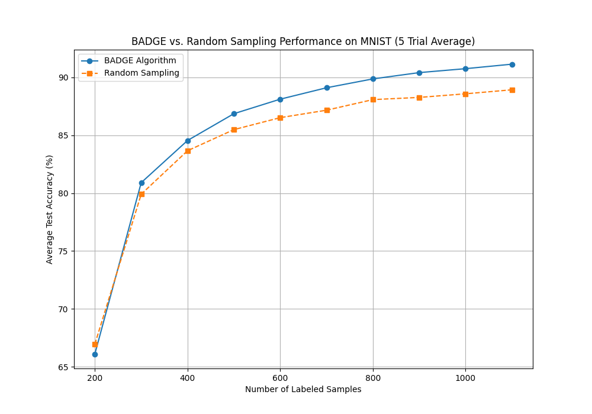

# Implementation of the BADGE Active Learning Algorithm

This project is a PyTorch implementation of the paper "[Deep Batch Active Learning by Diverse, Uncertain Gradient Lower Bounds](https://arxiv.org/pdf/1906.0371.pdf)". The primary goal was to replicate the paper's findings by comparing the label efficiency of the BADGE algorithm against a random sampling baseline on the MNIST dataset. This work serves as the foundation for future research into optimizing and accelerating the BADGE algorithm.

## Key Files
* `train.py`: The main script to run the full BADGE active learning experiment.
* `train_random.py`: A modified script to run the random sampling baseline experiment for comparison.
* `plot_results.py`: A utility script to parse the output files from the experiments and generate a comparative plot of the learning curves.
* `model.py`: Defines the simple Multilayer Perceptron (MLP) neural network architecture used for the experiments.
* `utils.py`: Contains helper functions, including the `kmeans_pp` and `compute_gradient_embedding` logic that forms the core of the BADGE selection strategy.

## Setup Instructions

To run this project, you'll need to set up a Python virtual environment and install the required dependencies.

1.  **Clone the repository:**
    ```bash
    git clone [https://github.com/Sangha0822/Deep-Batch-Active-Learning.git](https://github.com/Sangha0822/Deep-Batch-Active-Learning.git)
    cd Deep-Batch-Active-Learning
    ```

2.  **Create and activate a virtual environment:**
    ```bash
    python -m venv env
    source env/bin/activate
    ```

3.  **Install dependencies:**
    ```bash
    pip install -r requirements.txt
    ```

## How to Run the Experiments

The experiments should be run multiple times (e.g., 5 times each) to get a reliable average performance. The results will be appended to their respective `.txt` files.

1.  **Run the BADGE Algorithm:**
    ```bash
    python train.py
    ```
    *(Results are saved to `results_badge.txt`)*

2.  **Run the Random Sampling Baseline:**
    ```bash
    python train_random.py
    ```
    *(Results are saved to `results_random.txt`)*

3.  **Generate the Comparison Plot:**
    Once you have collected the data from both experiments, run the plotting script:
    ```bash
    python plot_results.py
    ```
    *(This will display the final plot and save it as `badge_vs_random_comparison.png`)*

## Results

The experiments successfully replicated the findings of the paper. The BADGE algorithm consistently outperformed the random sampling baseline, achieving a higher test accuracy with the same number of labeled samples. This demonstrates that BADGE is a more label-efficient training strategy for this task. The final plot below shows the averaged learning curves over 5 trials.



## Future Work

As per the original research goal, the next phase of this project is to address the primary bottleneck of the BADGE algorithm: the slow performance of the `compute_gradient_embedding` step. Future work will focus on brainstorming and implementing methods to accelerate this process without significantly compromising the quality of the sample selection.